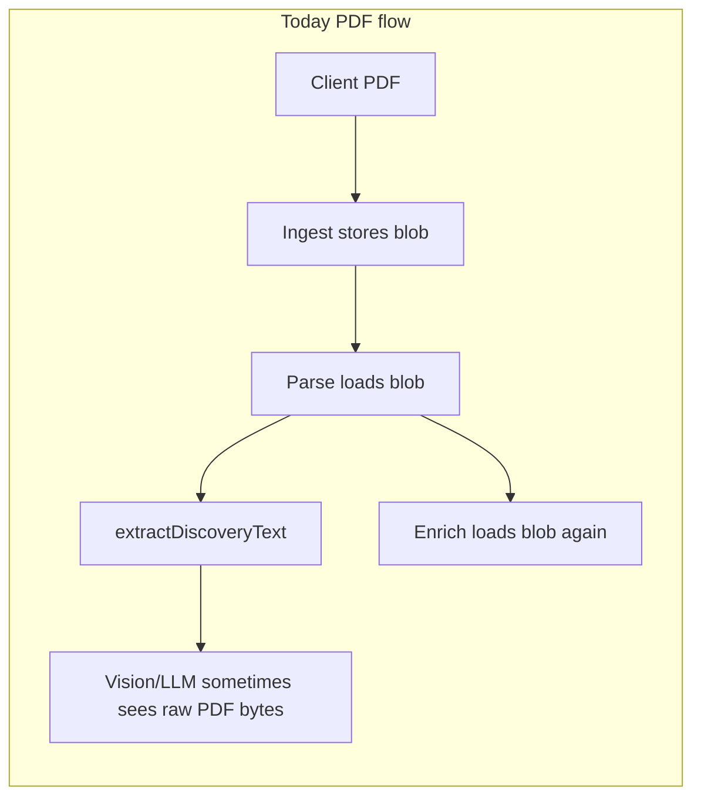

# PDF → image for models; no PDF persistence or public exposure

## Current behavior (what we are changing)

- `**[src/app/api/ocr/route.ts](src/app/api/ocr/route.ts)**` — For PDF uploads, `ocrBuffer` stays the raw file and is passed to `llmExtractEventFromImage(ocrBuffer, mime, ...)` (and the non-LLM path uses Vision with raw bytes). That is the “raw PDF as base64” path to the model.
- `**[src/lib/meet-discovery.ts](src/lib/meet-discovery.ts)**` — `extractTextFromPdf` ends with a fallback that calls `extractTextFromImage(buffer)` with the **PDF** buffer (lines ~3567–3574). `extractTextFromImage` assumes raster image input (Sharp resize → OCR). That is fragile and can effectively send non-image content toward vision/OCR.
- `**[src/app/api/ingest/route.ts](src/app/api/ingest/route.ts)`** — Discovery file ingest always `[uploadDiscoveryInputToBlob](src/lib/discovery-input-storage.ts)` + `[upsertEventHistoryInputBlob](src/lib/db.ts)` for **all valid files, including PDFs.
- **Parse / enrich** — `[src/app/api/parse/[eventId]/route.ts](src/app/api/parse/[eventId]/route.ts)` and `[enrich/route.ts](src/app/api/parse/[eventId]/enrich/route.ts)` call `loadDiscoveryInputBytes` and build a `data:application/pdf;base64,...` URL in memory (not persisted in `discoverySource.input`), but the **PDF binary still lives in blob/DB** for re-use on enrich.

**Public event page** — `[src/app/event/[id]/page.tsx](src/app/event/[id]/page.tsx)` passes full `data` as `clientSafeEventData` without stripping `discoverySource`. Today persisted `input` is usually metadata + `blobStored` (no `dataUrl`), but any future leak of `dataUrl` or blob URLs in JSON would expose the file. We should harden server-side shaping for **guest** responses.

## Target behavior

1. **Never send raw PDF bytes to vision/LLM** — Always rasterize pages with the existing stack already used for meet PDFs: `[getPdfPageImage](src/lib/meet-discovery.ts)` (Sharp PDF page + `pdfjs`/`@napi-rs/canvas` fallback) and/or a small shared helper (e.g. `src/lib/pdf-raster.ts`) imported from both meet-discovery and OCR.
2. **Do not store PDFs for discovery** — For `application/pdf` (and `.pdf` file names), skip `uploadDiscoveryInputToBlob` and `upsertEventHistoryInputBlob`. Persist only non-sensitive metadata on `discoverySource.input` (e.g. `type`, `fileName`, `mimeType`, `sizeBytes`, `blobStored: false`, optional flag like `ephemeralFile: true`). **Keep existing blob behavior for PNG/JPEG** unless you explicitly want those ephemeral too (default: PDF-only per your wording).
3. **Parse/enrich without a stored PDF** — Gymnastics needs a **second** full extraction in enrich mode, which today assumes blob-backed bytes. After ingest changes, the server must get bytes from the client again:

- **Recommended:** `POST /api/parse/[eventId]` accepts **multipart** with optional `file` when the event’s stored input is a PDF with `blobStored: false`. The handler builds an in-memory `DiscoverySourceInput` with `dataUrl` (never written to DB). Optionally **run enrich immediately after core parse in the same request** (reuse logic from `[enrich/route.ts](src/app/api/parse/[eventId]/enrich/route.ts)` via a shared internal function) so the customize page’s auto-enrich call becomes a no-op / fast 200. **Alternatively**, also teach `POST .../enrich` to accept multipart `file` for the same case (more client work, two uploads).
- **Football** — Only core parse; same multipart rule for PDF + no blob.
- **Repair** (`?repair=1`) — Today relies on blob; for PDF-ephemeral events, require `file` in the parse request or return a clear 400 telling the UI to re-upload.

1. **Do not publish PDF source on event / meet pages** — When building props for **non-owner / public** viewers, strip from `discoverySource` (or the whole subtree) anything that could carry PDFs or inline base64 sources: e.g. `input.dataUrl`, `input.storageUrl`, and any `application/pdf` `dataUrl` patterns. Owners may still see harmless metadata (file name, size) if the product needs it. Implement this in one place used by `[src/app/event/[id]/page.tsx](src/app/event/[id]/page.tsx)` (and any other route that serializes the same payload to the client) so guest HTML/JSON never contains PDF payloads.

## Legacy cleanup: delete existing PDF blobs (separate migration)

Run **after** the new ingest behavior ships (or in a controlled maintenance window), as a **standalone script**—not part of the hot request path. Goals:

- **Identify rows** in `event_history_input_blobs` where `mime_type` indicates PDF (`application/pdf` or similar) and/or `file_name` ends with `.pdf`, including rows that still have `data` bytea (pre–blob migration) vs `storage_pathname` only.
- **Delete the remote object** via Vercel Blob `del()` (or the SDK used in `[src/lib/discovery-input-storage.ts](src/lib/discovery-input-storage.ts)` / `[scripts/migrate-input-blobs-to-vercel.mjs](scripts/migrate-input-blobs-to-vercel.mjs)`) when `storage_pathname` is set.
- **Update Postgres**: set `data` to null, `storage_pathname` / `storage_url` to null (or delete the row entirely if the product no longer needs the join row for non-PDF bookkeeping—prefer clearing columns if other code expects the row to exist). Optionally set `discoverySource.input.blobStored` / workflow flags on `event_history.data` in a second pass if old events should match the new ephemeral-PDF contract (only if you want DB consistency for repair UX; otherwise blob cleanup alone may suffice).
- **Safety**: `--dry-run`, logging counts, batching with limits, and idempotency (deleting already-missing blob keys should not fail the whole run).

## Implementation notes

- **OCR route:** For PDF, rasterize at least page 0 to PNG, then run the same LLM/Vision paths you use for images (`image/png`). Match reasonable DPI/scale with meet-discovery (Sharp `{ density: 220, page: 0 }` is already used elsewhere).
- **Meet-discovery:** Replace the `extractTextFromImage(buffer)` fallback inside `extractTextFromPdf` with explicit `getPdfPageImage` loops (e.g. page 0, then more pages until budget/quality), so PDF never enters `extractTextFromImage` directly.
- **Clients to update** (must send PDF on parse when blob skipped): `[src/components/event-create/GymnasticsLauncher.tsx](src/components/event-create/GymnasticsLauncher.tsx)`, `[src/components/event-create/FootballLauncher.tsx](src/components/event-create/FootballLauncher.tsx)`, `[src/app/event/gymnastics/customize/page.tsx](src/app/event/gymnastics/customize/page.tsx)` discover flow, and any other caller of ingest+parse for discovery.
- **Tests / guards:** Adjust `[src/lib/meet-discovery.test.ts](src/lib/meet-discovery.test.ts)` if extraction behavior strings change; add a focused test that PDF fallback does not call image OCR with a PDF buffer (mock/spy if the suite supports it).

## Out of scope (unless you ask)

- Changing non-discovery flows (e.g. generic event attachments) — only discovery ingest/parse/enrich and `/api/ocr` PDF handling per this plan.
