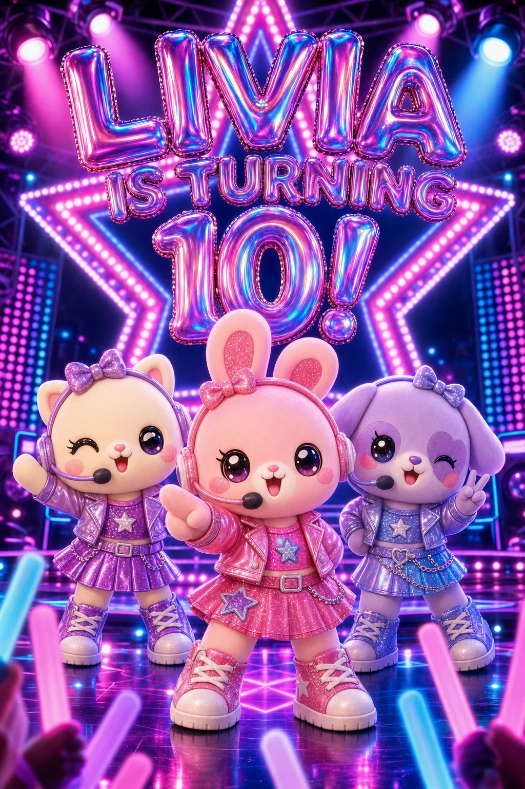

# Invitation artwork verification — September 8, 2026

The local creator preserves detailed art direction and explicit headlines. The Livia verification draft now shows three rounded toy performers on a pink, purple and blue concert stage, with the exact headline **LIVIA IS TURNING 10!**. Following the user's placement correction, guest action buttons overlay the bottom of the artwork without a black footer. This draft is unpublished; application changes are local and have not been deployed.

The subsequent [streaming workflow verification](streaming-workflow.md) records intermediate previews, real stage updates, image reuse for event-detail edits, and measured local timings. Its additional artwork and cleanup record are separate from the original three images below.

## Root causes and changes

- Extraction used the next missing question to discard the current message's art direction. Removed that gate, retained short logistics reply protection, and added a verbatim fallback for explicit visual instructions.
- Exact headline wording was not recognized as a title, and the birthday builder prioritized a generated default. Headline extraction now retains punctuation; the supplied title wins.
- New artwork uses high quality by default, complete composition and integrated lettering. Flyer exports preserve the whole image, with text generated and checked as part of the design.
- New and edited artwork checks include requested subjects, palette, exclusions, framing and wording, with one targeted repair. Unavailable checks are disclosed in the preview.
- Poster controls overlay the bottom of the rounded image, without a black panel. Existing overlay mode remains supported for older designs.

## Verification

- 177 targeted tests pass, covering extraction, exact titles, complete visual briefs, request building, image generation/editing, quality defaults, targeted repairs and flyer exports.
- Biome lint passes on changed production files. Git whitespace check passes.
- Full TypeScript checking reports existing repository errors, with none in the production files changed in this task. The VS Code diagnostics command could not run because its Chat to CLI bridge is unavailable.
- Wider source guards still have three previously existing failures: two in chat/page.test.mjs and one public cover-image guard in card/[id]/page.test.mjs. The affected card layout guards pass.
- Verified the actual signed-in /chat creator on desktop and at 390 × 844. Checked RSVP choices and disabled preview submission, event overview, location, and calendar links. Calendar metadata retains October 24, 2026, 4–6 PM in America/Chicago.
- Real generation was tested on this birthday draft. Wedding and uploaded-photo generation were not separately exercised in the browser.

## Artwork records

1. 01-rejected-generic.webp: failed baseline with the wrong wording and generic birthday props.
2. 02-concert-dolls.webp: restored complete brief and headline; three doll performers.
3. 03-livia-toy-concert.webp: refined to rounded non-human toy mascots while retaining the concert scene.

All three files were encoded from their PNG originals with FFmpeg libwebp, quality 85, compression level 6. Verified dimensions (1024 × 1536), transparency status, decoding and uploaded byte identity. The three matched remote PNG originals and local temporary copies were deleted after verification. The draft references the final WebP. See artwork-provenance.json for hashes and stored paths.
