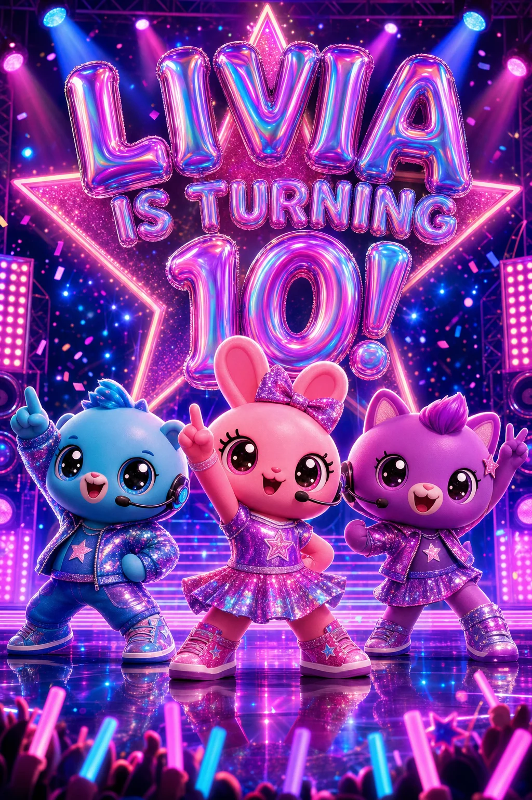

# Generation workflow verification — September 8, 2026

Applied locally to the signed-in `/chat` creator. Both verification drafts remain unpublished.

Subsequent user correction: guest action buttons are restored as overlays inside the bottom of the artwork, without a black footer. This applies to creator and shared-card renderers; the existing image was retained. The earlier timing observations below describe the streaming run before this placement correction.

## Changes

- The image provider streams intermediate artwork through the authenticated generation route. The browser shows partial artwork and the completed image while quality checking and persistence continue. Temporary previews do not replace the saved card or permit publishing during generation.
- Progress comes from actual preparation, planning, drawing, checking, refinement, export, and persistence stages. Removed the random progress percentage.
- New images retain a contract describing their printed text. Headline-only Live Cards reuse artwork when dates, times, locations, or RSVP details change. Flyers and unclassified older/imported images remain conservative because their images may contain logistics.
- Preserving an image is not a request for a new theme. Regression coverage includes the complete fallback extraction → AI merge → artwork reuse path for “Change only the date … Keep the artwork unchanged.”
- A failed optional chat reply no longer hides Generate preview when the event details are ready.
- Image requests have a three-minute stream deadline and no hidden SDK retries. Resetting or switching conversations cancels the active generation, and stale callbacks cannot replace the next draft.
- The server records stage durations, first preview time, and image attempt count without prompts, images, or contact details. The development client logs the returned timings.

## Live measurements

Verified in the complete signed-in `/chat` UI, with a new disposable draft (`session_mts1dzm3`). The original reviewed draft (`session_mtrzi8fu`) was preserved.

- First partial artwork was loaded and visible by 39.1 seconds after Generate preview was clicked.
- The completed render response arrived after 137.4 seconds (2 minutes 17 seconds): 02:21:18.901Z to 02:23:36.269Z. This includes the image-generation workflow, not the preceding chat intake.
- The date-only edit completed within 11 seconds with the exact same saved WebP URL and the “artwork is unchanged” confirmation. No new image was generated.
- A consecutive edit restored October 24 and the complete address while preserving the same image again. Calendar links were verified for October 24, 4–6 PM in America/Chicago, with the complete Celebration Hall address.
- The first view of a partial render displayed Drawing your artwork, with the image visible and publishing unavailable. The final picture has the requested exact headline, three expressive toy performers with headsets, holographic lettering, pink/purple/blue concert lighting, a giant star, reflective stage, and foreground glow sticks. Actions sit below the artwork without a black panel.

These are observations from one local run, not speed guarantees. High-quality image generation still dominates total wait. Initial conversational replies timed out during testing, and automatic visual review returned unavailable; the final preview disclosed that limitation. The final artwork was inspected manually. Partial frames remain display-only and are never persisted as approved images.

The live test exposed a preservation sentence overwriting the theme and causing an unwanted date-edit render. That render was cancelled, the verification draft's original theme was restored from its saved invitation metadata, and the corrected workflow passed the repeated date-only check.

## Validation and assets

- 93 targeted tests passed, covering generation, streaming, reference images, editing, prompt preservation, cancellation, malformed/truncated streams, QA gating, image reuse, and metadata persistence.
- Biome passed on the changed production files. Full TypeScript checking reported existing repository errors, with none in the changed production files.
- VS Code diagnostics could not run because the Chat to CLI linter bridge is unavailable. The wider chat source-guard suite retains two pre-existing failures; the updated streaming guard passes.
- `04-streamed-concert.webp` was encoded directly from the generated PNG using FFmpeg libwebp, quality 85, compression level 6. Verified WebP format, decoding, 1024 × 1536 dimensions, no alpha, and byte-identical remote upload. Deleted the exact matched remote PNG and local temporary PNG after verification. The verification draft now uses the final WebP. Details are in `streaming-provenance.json`.

