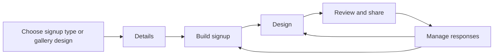

# Signup forms: theme system and workflow plan

Prepared September 7, 2026. This is a proposed implementation plan based on the current local workspace, including the template-gallery and shared-header changes present during review. It does not represent a shipped feature set.

**Recommendation:** turn signup forms into coordinated event pages with a complete visual theme, useful starting content, and a reliable path from creation to participation. Build on the existing slot, question, capacity, waitlist, and draft foundations.

## 1. What exists today

| Area | Verified current state | Implication |
|---|---|---|
| Artwork | 152 manifest entries, 144 distinct image paths, 11 populated categories. All referenced files exist. Metadata reports 142 WebPs and 2 PNGs, all 1600 × 1200. TypeScript and JSON catalogs match. | There is enough artwork to start. Curate and connect it to complete themes before commissioning a large new batch. |
| Public gallery | `/signup-forms/templates` exposes 144 designs with search, a style filter, and pagination. It already uses the shared square thumbnail components. | Preserve the gallery standard; improve the content rendered inside the square. |
| Gallery previews | Each signup preview is seeded from the same mostly blank default form with a different title and image. In the desktop walkthrough, the miniature form occupies a small portion of the square with substantial empty space. | Give previews meaningful sample sections and fuller page composition. |
| Appearance controls | The builder exposes 14 design categories, color stories, image selection/upload, and six header layouts. Types also accept legacy header IDs 7–10. | These are useful ingredients, but there is no single complete theme contract. |
| Form structure | Sections, slots, capacities, time ranges, notes, text/multiline questions, duplication, and reordering exist. | Preserve these capabilities and add purpose-specific starters. |
| Creation | Event Basics → Smart Settings → Build Form → Launch. Basics includes logistics, audience, safety, raw design metadata, artwork, palettes, layouts, and preview. | The first step asks too much before users have built their signup needs. |
| Drafts | The public template editor supports temporary browser drafts, a seven-day expiry, authentication handoff, and private account drafts. The direct `/smart-signup-form` route uses component state and a separate duplication handoff. | Reuse the stronger draft flow across all entry routes. |
| Participation | Public viewing exists. Reserving requires a signed-in user who owns the form or is an accepted shared recipient. | Public visibility and permission to participate need distinct, explicit controls. |
| Host tools | Claimed/remaining totals, response lists, response editing/removal, and form duplication exist. | Improve management around the existing host dashboard. |

Scope of verification: browser walkthrough of the public gallery and all four editor steps; source review of rendering, persistence, reservation, email, catalog, and draft paths; metadata inspection of all 144 distinct artwork files; 15 passing existing signup-planning and public-template-flow tests. No live form was published or real reservation submitted. Authenticated participation, delivery of emails, and concurrency were not exercised against a database.

## 2. Findings to address first

### P0 — trust and data correctness

1. **An appearance save must preserve live responses.** The public page reads `event_history.data.signupForm`; the reservation handler prefers `signup_forms.form`. Reservation writes update both separately, whereas the general history PATCH path does not explicitly synchronize the signup table. A later reservation can therefore use an older definition. Establish one authoritative read/write service and atomic synchronization before expanding live theme editing. Do not send stale response arrays from an editor snapshot as replacement data.
2. **Reservation mutations need a transaction.** The inspected path reads the form, computes remaining capacity, and writes the whole response array without a shared row lock or revision check. This presents a lost-update/capacity race; it was identified in code, not reproduced under load. Lock the same event row for reserve, cancel, and definition edits; re-read and validate inside the transaction. Add retry/idempotency protection.
3. **Enforce exposed rules on the server.** Opening/closing times and `maxSlotsPerPerson` are stored and editable but not checked in the reservation handler. The viewer does not consume `showRemainingSpots`. Reading the form repeatedly forces `enabled: true`, so a dedicated closed/disabled state needs to be respected. Phone/email requiredness also needs the same contract in UI and API.
4. **Use explicit participant permissions and response ownership.** Reserve-by-`signupId` does not apply the same ownership check as cancellation and sets `userId` from the current caller. Cancellation's ownership condition also needs a rule for legacy responses without a user ID. Restrict edits to the response owner or organizer; verify legacy ownership through a deliberate recovery mechanism.
5. **Project public response data on the server.** The inspected public projection retains signup response objects, which are passed into a client component; returning the full form after reservation also includes response records. Hiding host-only UI is insufficient. Public payloads should contain slots and counts; participants receive only their own private response; organizers receive authorized response details. Treat `hideParticipantNames` as a data-projection rule when names are supported, not merely a display toggle. Production exposure was not probed.

These are concrete prerequisites for reliable live editing and any new open-link participation mode. They should not prevent building isolated theme previews in parallel within the implementation schedule.

### P1 — visual and workflow gaps

1. **Themes stop largely at the header/background.** Slot selection uses fixed blue styling, submission uses a fixed green gradient, and surfaces/fields use fixed gray and white. Header button-color values do not theme the main signup CTA. Typography, field style, section treatment, and success/error states are not coordinated.
2. **Preview differs from publication.** The wizard Launch step renders `SignupViewer` without `SignupTemplateHeader` or the public page wrapper. The browser walkthrough confirmed the chosen artwork disappears from Launch. The builder also has its own extensive header-preview markup.
3. **Header image mapping disagrees.** Builder layouts 3 and 4 put banner artwork in `header.images`; the shared public header treats only layouts 5 and 6 as galleries and otherwise reads `backgroundImage`. Preserve all six layout semantics with shared resolution and rendering.
4. **Empty forms can reach Launch.** Only the address is checked on the first Continue. Empty slot labels reach a preview showing “100% Complete”; sanitization subsequently removes empty slots and disables forms with no sections. Validate actual publish readiness and distinguish it from step position.
5. **Artwork categories drift.** Spring, Summer, and School & Education are offered in the builder but absent from the current manifest. The image API eventually tries every manifest key, so an unavailable category can return unrelated fall artwork. Return a true empty state or an explicit curated fallback, and derive picker categories from available metadata.
6. **Search does excess work.** Builder image search fetches each category on each query change, then filters filenames client-side. Load one searchable metadata index, deduplicate by stable asset ID, and debounce or filter locally. Preserve names, tags, category, and tier metadata instead of returning only URLs. Premium labels in data are not proof of an implemented entitlement policy.
7. **Several design fields are confusing.** Theme Category, Theme Image URL, Color Story, and Header Template free-text fields coexist with visual controls. Keep legacy values readable while consolidating authoring into one Design panel.
8. **Communication claims exceed what was verified.** Confirmation-email code exists, but no consumer that schedules `autoRemindersHoursBefore` was found in the reviewed code. Waitlist rebalancing exists; promotion email delivery was not verified. The viewer promises real-time slot updates without polling or a subscription in that component. Prove delivery/update behavior or adjust the affected copy until implemented.
9. **Creator/date display needs correction.** The public page's “Created by” block uses the current viewer's session name and places its date inside that session-dependent block. Resolve organizer identity from the event owner and render the date independently for all permitted viewers.

## 3. Product model: starter, theme, customization

Use three distinct concepts in the product:

- **Signup type:** sets useful sections, slot labels, quantities, questions, and defaults. Examples: potluck, volunteer shifts, classroom supplies, team snacks, community helpers, workshop places.
- **Theme:** applies a coordinated page background, artwork, color palette, heading/body fonts, header layout, section/slot styling, fields, buttons, and feedback states.
- **Customize:** adjusts that theme with another palette, approved font pair, photo, focal point, header layout, and comfortable/compact density.

Example: “Team snacks” creates Snack / Drinks / Fruit needs. “Game Day” gives them a team-colored appearance. The organizer can change to “Clean & Clear” while all labels, capacities, dates, IDs, and responses stay intact. Applying a different signup type to a populated form should show a content-change review with an append option; ordinary theme switching never replaces content.

### Proposed initial theme collection

Launch six curated families. Ship the first three as a vertical slice, then complete the set using the same components.

| Theme | Art direction | Best-fit starters | Distinctive treatment |
|---|---|---|---|
| Clean & Clear | White, soft stone, restrained indigo; readable sans serif | Workshops, professional groups, general signups | Compact header, crisp rows, clear capacity labels |
| Harvest Table | Warm ivory, terracotta, deep olive; expressive serif heading | Potluck, meal trains, seasonal gatherings | Wide food/seasonal hero, warm section cards |
| School Days | Cream, ink blue, small sunny accents; friendly heading | Classroom supplies, reading helpers, field trips | Illustrated cover and clear supply quantities |
| Game Day | Deep navy, team-color accents; bold heading | Team snacks, concessions, tournament volunteers | Strong title block, time/role emphasis |
| Community Garden | Sage, forest, parchment; welcoming serif heading | Community meals, church helpers, cleanups | Photo split header and gentle grouping |
| Celebrate Together | Soft blush/lilac with a strong readable accent | Parties, family gatherings, club socials | Playful artwork and rounded slot cards |

These are proposed directions, not finished or contrast-validated palettes. Start each family with two or three approved color variations. Reuse existing images where appropriate; the missing school category needs curation or new artwork. Avoid turning every image into a separate renderer.

### Customization scope

| Control | First release | Later extension |
|---|---|---|
| Theme | Full-page preset; reset appearance; undo theme change | Save a personal theme |
| Colors | Approved palettes and bounded accent override with contrast validation | Saved organization palettes |
| Fonts | Small curated set of heading/body pairs using available licensed fonts | Additional optimized font packages |
| Header | Preserve six current layouts; add an explicit no-image option | Additional layouts only when useful |
| Artwork | Existing library, uploads, replace/remove, focal point, crop preview | Optional generated artwork |
| Content presentation | Section cards or compact rows; comfortable/compact density | Agenda grouping after a real slot-date model exists |
| Identity | Group name, organizer identity, organization image | Reusable organization profile |
| Form fields | Consistent size, border, focus, error and help text | More question types in a separate increment |

Keep the locked Envitefy wordmark unchanged. Scope all form-theme styles to the signup page so they cannot alter dashboard cards, app navigation, or other event designs.

## 4. Improved organizer workflow



The initial choice is a short starter screen outside the four-step editor. Gallery visitors arrive with a design selected and can choose a compatible signup type without losing it.

1. **Details.** Ask for title, organizer/group, date or an explicit date-not-set choice, timezone, and location mode: in person, online, or to be announced. Require a street address only when appropriate. Put parking, accessibility, arrival, audience, and safety guidance in optional groups. Consolidate overlapping arrival/parking fields through a documented mapping.
2. **Build signup.** Start with editable example needs for the chosen type. Put capacity and selection rules beside the slots they affect. Support duplicate/reorder and a batch operation such as “create shifts every 30 minutes.” Keep keyboard move controls even if drag-and-drop is added. Use item quantity for potlucks and supplies; distinguish it from number of people for shifts. Add a visible count of sections, slots, and available units.
3. **Design.** Put theme selection first, then Colors, Fonts, Header & images, and Layout. Give users a live full-page preview, a clear active theme, and an undo/reset action. Keep advanced options collapsed. On desktop, use editor controls beside a preview; on mobile, use an Edit / Preview switch with a reachable action bar. The preview must remain responsive to every change.
4. **Review and share.** Show the complete rendered page plus a short readiness list. Blocking items: missing title, no usable slots, invalid capacity/time range, conflicting open/close dates, invalid media, or missing required location details for the selected mode. Link each error to its field. Offer “Save draft” and “Publish” with distinct meanings. Display who can view and who can sign up before publishing. After success, show the canonical link, QR option using existing sharing components where available, and a route to Manage responses.

Use step names and actual completion checks instead of implying a blank form is 25% done on entry or 100% ready merely because Launch is open. Preserve entered data when revisiting steps. This follows W3C guidance on logical grouping, optional stages, and navigable progress in [multi-page forms](https://www.w3.org/WAI/tutorials/forms/multi-page/).

**Draft behavior:** one draft runtime across gallery, direct create, duplicate, and edit. Reuse current IndexedDB/media/authentication handoff. Add honest save status and failed-save retry. Serialize writes and use revision checks so an older autosave cannot replace newer content. Duplicate into a new identity with responses cleared and dates/settings offered for review. Editing a published form should explicitly apply changes to the existing URL; a design-only save preserves every current response and slot ID.

## 5. Improved participant and host workflow

**Participant:** open link → see event and access state → select needs → enter requested details → review selections → confirm → see a durable confirmation with their selected items, date/time, calendar action, and edit/cancel route.

- Explain access before presenting unusable controls. Keep current invite-only semantics for existing forms.
- Add an organizer-controlled “Anyone with the link can sign up” mode as a separate release after permission, privacy, and transactional fixes. New participation permission must not automatically make a page searchable. Keep draft visibility, public viewing, search indexing, and reservation access separate.
- For open-link forms, support participation without requiring an Envitefy account, with verified email or a signed, expiring management link to establish response ownership. Add rate limiting and duplicate-submit protection. Do not identify an editable response solely by a user-entered email or public response ID.
- Preserve selections through sign-in, expired sessions, network errors, and capacity conflicts. If a slot fills before confirmation, explain the changed availability and offer an alternative or waitlist choice.
- On mobile, keep a compact selected-items summary and clear next action. Use distinct confirmed, waitlisted, closed, not-yet-open, full, cancelled, and unavailable states. Give waitlist status explicit copy rather than a generic success message.
- Make phone collection optional by default for suitable new starters, while preserving existing settings. Request only information relevant to the signup purpose.
- Refresh availability on focus and after mutations; add bounded polling while an interactive form is open if justified. The server always makes the final capacity decision.

**Host:** open the existing dashboard → see unfilled needs and response status → filter/search responses → edit or contact participants → duplicate for the next event.

Add status/section filters, name search, export with owner authorization and spreadsheet-formula escaping, and an explicit close/reopen action. Show a preview of outgoing messages and actual delivery status when messaging is implemented. Theme confirmation emails using safe email-compatible colors and artwork while keeping transactional information prominent. Schedule reminder and promotion messages durably with retries and deduplication before promising delivery.

## 6. Technical design

### One versioned appearance object

Add an optional `appearance` field to the existing form without forcing a destructive overall form migration. Give the appearance schema and each theme revision independent versions. Store approved identifiers and bounded overrides; resolve derived CSS at render time.

Illustrative shape, not a final exported API:

```ts
type SignupAppearance = {
  version: 1;
  themeId: string;
  themeRevision: number;
  paletteId: string;
  fontPairId: string;
  headerLayout: SignupHeaderLayoutId;
  slotLayout: "cards" | "rows";
  density: "comfortable" | "compact";
  accentOverride?: string;
  hero?: SignupThemeMedia;
};
```

`SignupHeaderLayoutId` should be a validated union. `SignupThemeMedia` should reference retained media with dimensions and bounded focal-point coordinates, including gallery images where needed. Theme IDs are validated against the registry, not trusted solely because they are strings.

Legacy resolution: explicit new appearance → normalized legacy header palette/layout/assets → stable default. Preserve existing rendered values for legacy forms until the organizer changes the design. Snapshot or retain theme revisions so changing a registry default does not silently redesign already-published forms. Map IDs 7–10 to their current fallback behavior; do not invent new layouts for old records. Keep existing public URLs and template IDs working even if an asset format changes.

### Shared renderer and scoped tokens

Create a `SignupPageRenderer` composition used by gallery previews, builder preview, Launch, and the public page. Reuse and complete `SignupTemplateHeader`; split `SignupViewer` into a presentational board, participation controller, and organizer dashboard. Thumbnail rendering must not initialize request handlers or owner controls. Preview simulation can show selection and confirmation locally without submitting requests.

Resolve tokens through primitives → semantic roles → component styles. Suggested scoped roles include page/surface/foreground/muted/border, accent/on-accent/focus, selected-slot surface/border, button normal/hover/disabled, field normal/error, status text/background, heading/body font, radius, and spacing. All meaningful states must work in every shipped theme; status needs text/icon cues in addition to color.

Use `TemplateThumbnailFrame` and `TemplateThumbnailPreview` for full design pickers and galleries: square viewport, current inset/corners/border/shadow, quarter-scale actual layout, inert preview. Keep selection/favorite controls outside it. Seed a compact but meaningful form that uses the square effectively. Image-only choices can use `scaled={false}`; palette and font swatches remain separate controls.

### Persistence and migration

For the first release, make `event_history.data.signupForm` the documented authority, with `signup_forms` maintained as an atomic compatibility projection. This follows the existing legacy-authority intent while eliminating table-first stale reads. Use a common service for page/dashboard/API reads and updates.

- Definition updates accept permitted definition/appearance fields, preserve server-owned responses, and validate stable section/slot/question IDs. Reject destructive changes affecting existing claims unless the organizer completes an explicit migration/reassignment flow.
- Reserve/cancel operations lock the shared event row, check the latest rules, update responses, rebalance waitlists, and update both stores in one transaction. Return audience-specific DTOs after commit.
- A design save must merge against the latest server definition and response state. Revision conflicts return a recoverable conflict instead of silently overwriting changes.
- Preserve canonical top-level title, start/end fallbacks, timezone, category, ownership (`My events`), creation method, and publication state. Reuse the draft-payload and event normalization work already in the repo.
- Invalidate history and dashboard caches for affected owners/shared viewers, plus any public render cache introduced by the implementation.
- Reconcile existing divergent records with a read-only report and reviewed policy before a backfill. Do not assume one timestamp can recover already-divergent response arrays. Retain rollback snapshots and legacy read support during rollout.

### Proposed file responsibilities

| Existing area or proposed file | Work |
|---|---|
| `src/types/signup.ts`, `src/utils/signup.ts` | Concrete appearance types, legacy normalization, separate draft/publish validation, consistent settings |
| New `src/lib/signup-themes/` | Registry, palettes, font pairs, layout metadata, legacy resolver, token resolution |
| `SignupBuilder.tsx`, `Wizard.tsx` | Extract details, slot builder, rules, design panel, and review steps from the 5,231-line builder |
| `SignupTemplateHeader.tsx`, new `SignupPageRenderer.tsx` | Shared six-layout header and full-page preview/public composition |
| `SignupViewer.tsx` | Split board, form controller, status/confirmation, and owner dashboard; consume theme tokens |
| Public catalog/gallery and `/templates/signup` | Useful preview data, stable catalog identities, one template application function |
| Direct signup page and `TemplateEditorContext.tsx` | Consistent drafts, duplication, edit hydration, save/publish behavior |
| Signup API, history API, new signup service in `src/lib/` | Transactional definition/reservation writes, access checks, privacy projections, revisions |
| `src/lib/db.ts` and manual SQL | Queries, migration/reconciliation support; use the actual Postgres/JSONB model |
| Template image API and manifests | One searchable metadata contract; correct category handling; retain edge runtime |
| Email/job infrastructure | Verified confirmations, reminder scheduling, waitlist promotion, retries and delivery outcomes |
| `src/lib/product-marketing-catalog.ts` | Update only when each customer capability ships and is verified |

Any new generated raster artwork must follow the standing FFmpeg WebP workflow, including verification and cleanup of exactly matched generated originals. The two existing PNGs are not part of an automatic generation-cleanup task.

## 7. Delivery sequence

Effort ranges are planning estimates for one experienced engineer with timely design review and a usable test environment. They are not a delivery commitment; database reconciliation and email infrastructure may change the scope.

| Phase | Deliverable | Exit criteria | Estimated working days |
|---|---|---|---|
| 0. Correctness foundation | Common persistence service, response ownership/privacy, rule enforcement, transaction coverage | Concurrent last-slot requests are safe; design saves preserve claims; public clients receive no private response details | 3–5 |
| 1. Theme vertical slice | Versioned appearance, legacy adapter, shared renderer, Clean & Clear / Harvest Table / Game Day | Gallery → preview → publish use the same design; legacy layouts/assets remain intact | 4–6 |
| 2. Creator workflow | Starters, Details → Build → Design → Review, unified drafts, inline publish validation | A useful form can be created, resumed, themed, and published without raw design fields or blank-slot launch | 4–6 |
| 3. Theme collection and gallery | Complete six themes, approved variants, image crop/focal point, metadata search, mobile refinement | Every shipped theme passes visual/state QA; no unrelated category fallback | 3–5 |
| 4. Participant and host improvements | Explicit access modes, optional open-link participation, reliable confirmation/management, search/export, verified notifications | Full participant lifecycle works for the intended audience; access and indexing remain independent | 5–8 |
| 5. Rollout and measurement | Migration checks, regression runs, production monitoring, catalog updates | Legacy forms remain usable, no response loss, verified customer-facing claims | 2–3 |

Total planning range: **21–33 working days**, approximately **4–7 weeks** sequentially. A reviewable first theme slice should be possible after Phases 0–1, approximately 7–11 working days. If the first release needs to be smaller, ship Phases 0–2 with three themes and retain invite-only participation; deliver the remaining themes and expanded participation afterward.

Avoid adding AI generation, a free-position page editor, payment collection, conditional question logic, or a new scheduling/date model to the first theme release. Each deserves its own scope and validation.

## 8. Acceptance checks and measurement

**Theme and preview:** screenshot comparisons for every shipped theme at phone, tablet, and desktop widths; all six legacy headers; long titles; no image; failed image; image galleries; dense slots; empty states; and confirmation/error states. Verify a live theme switch updates preview immediately and does not reset content. Confirm there is no navigation or request behavior inside thumbnails.

**Accessibility:** target WCAG 2.2 AA, including associated labels, keyboard navigation, visible focus, error announcements, and text contrast. Validate actual rendered colors rather than the current brightness heuristic: at least 4.5:1 for ordinary text and 3:1 for qualifying large text. See [W3C contrast guidance](https://www.w3.org/WAI/WCAG22/Understanding/contrast-minimum.html). Use 44px primary touch controls as a product target; the AA target-size criterion has a 24 × 24 CSS-pixel minimum with specified exceptions, so these should not be conflated. See [W3C target-size guidance](https://www.w3.org/WAI/WCAG22/Understanding/target-size-minimum.html). Test 200% zoom, narrow reflow, and reduced motion.

**Data and participation:** tests for draft/auth handoff, duplicate identity, theme-only save during a new reservation, stale autosave, last-slot contention, duplicate requests, waitlist promotion/cancellation, opening/closing times with timezone and DST, disabled forms, per-person limits, and unauthorized response edits. Verify public payloads and mutation responses contain only permitted fields. Test deletion/reordering of slots that already have claims.

**Communications:** confirmation, waitlist, promotion, cancellation, and reminder jobs tested with provider mocks and a controlled mailbox; verify retries, idempotency, timezone handling, and delivery failure UI. No scheduled-reminder promise based only on a stored setting.

**Repository checks:** run targeted behavioral tests, Biome, and `npm run lint:vscode -- <touched files>` for implementation changes. `next build` alone is insufficient because TypeScript build errors are ignored by configuration. Extend the current 15 passing tests with meaningful behavior coverage; source-shape guards alone cannot validate this plan.

**Measure before and after:** creation starts → usable slots → design applied → publish; median time to publish; abandonment per step/device; draft recovery success; guest view → permitted participation → selection → confirmation; reservation conflicts; waitlist conversion; and save failures. Record theme/starter IDs and counts, never participant answers or contact information in analytics. Establish the baseline first, then set improvement targets. Useful product goals to test include publishing a simple starter-based form in under five minutes and completing a guest signup in under one minute; these are proposed usability targets, not measured results.

## 9. Evidence map

Paths below are relative to `/Users/rj/Local_Dev/envitefy`; names/locations reflect the inspected workspace and may shift with ongoing edits.

- `src/types/signup.ts`: current form, header, response, settings, and category contracts.
- `src/assets/signup-templates.ts`, `public/templates/signup/manifest.json`: artwork inventory and metadata.
- `src/components/smart-signup-form/SignupBuilder.tsx`: artwork search, palette generation, six header previews, long Basics panel, settings and slot controls.
- `src/components/smart-signup-form/Wizard.tsx`: step order, address-only Continue check, viewer-only Launch preview.
- `src/components/smart-signup-form/SignupTemplateHeader.tsx`: shared public/gallery header and image mapping.
- `src/components/smart-signup-form/SignupViewer.tsx`: fixed UI colors, reservation requests, host dashboard, success and reminder claims.
- `src/app/smart-signup-form/page.tsx`, `src/app/templates/signup/page.tsx`: distinct direct/template creation and duplication paths.
- `src/components/templates/TemplateEditorContext.tsx`: stronger existing draft and authentication flow.
- `src/components/templates/PublicTemplateGallery.tsx`, `src/lib/public-template-catalog.ts`: gallery preview seed and image-derived template IDs.
- `src/app/api/templates/signup/route.ts`: category fallback and URL-only API response.
- `src/app/smart-signup-form/[id]/page.tsx`: public read source, viewer permissions, creator/date display, page/header/viewer composition.
- `src/app/api/history/[id]/signup/route.ts`: participation access, response mutations, settings enforcement gaps, dual writes, confirmation email call.
- `src/app/api/history/[id]/route.ts`, `src/lib/db.ts`: definition updates, normalized table operations, public JSON projection.
- `src/utils/signup.ts`: sanitization, removal of blank slots, enabled state, waitlist rebalancing.
- `src/lib/email.ts`: signup confirmation-email implementation.
- `src/components/smart-signup-form/signup-planning.test.mjs`, `src/lib/public-template-flow.test.mjs`: 15 existing tests passed during this review.

Recommended implementation starting point: **the common signup persistence service and shared full-page renderer**, followed immediately by three complete themes and the focused four-step editor.
